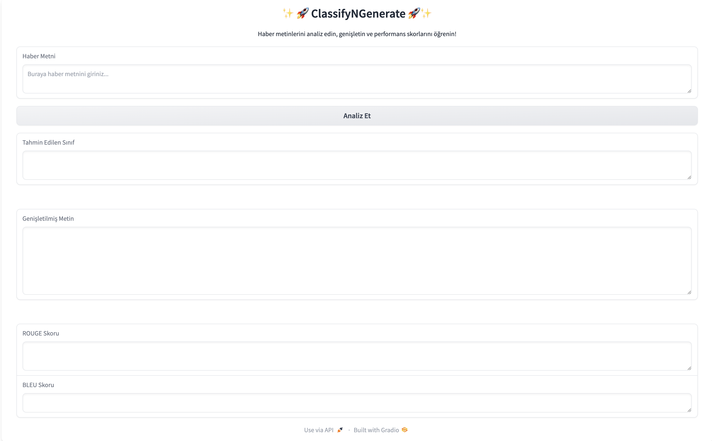
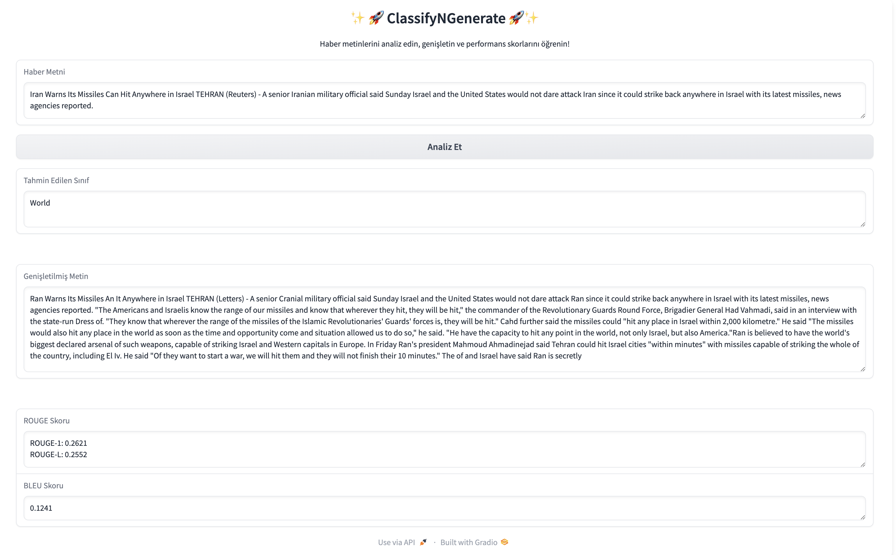

# **ClassifyNGenerate: AI-Powered News Classification and Text Generation**


# ✨🚀 ClassifyNGenerate 🚀✨

ClassifyNGenerate, haber metinlerini analiz eden, sınıflandıran ve genişleten bir sistemdir. Bu proje, metin sınıflandırma ve metin genişletme süreçlerini entegre ederek kullanıcılara etkili bir haber analizi sunmayı amaçlar. 

## 🎯 Projenin Amacı
1. **Haber Metni Sınıflandırma:** Kullanıcı tarafından verilen haber metnini analiz ederek doğru kategoriyi tahmin eder.
2. **Haber Metni Genişletme:** Tahmin edilen metni daha detaylı hale getirir.
3. **Performans Ölçümü:** Genişletilmiş metnin kalitesini ROUGE ve BLEU metrikleri ile değerlendirir.

## 📂 **Proje Dosya Yapısı**
```plaintext
Project/
├── modules/                      # Ana modüller
│   ├── data_processing.py        # Metin ön işleme yardımcı araçları
│   ├── model_training.py         # Model eğitimi ve kaydetme
│   ├── predict.py                # Tahmin ve sınıflandırma
│   ├── text_generation.py        # LLaMA kullanarak metin genişletme
│   ├── model_loader.py           # LLaMA model yükleyici
├── data/                         # Veri dizini
│   ├── train.parquet             # Eğitim verisi
│   ├── test.parquet              # Test verisi
├── models/                       # Kaydedilen modeller
│   ├── logistic_model.pkl        # Logistic Regression modeli
│   ├── vectorizer.pkl            # TF-IDF vektörleştirici
│   ├── Llama-3.2-3B/             # LLaMA 3.2 model dosyaları

```


## 🚀 Nasıl Çalışır?
1. **Metin Temizleme:** Haber metni işlenir ve temizlenir.
2. **Sınıflandırma:** Logistic Regression modeliyle metin sınıfı tahmin edilir.
3. **Metin Genişletme:** LLaMA modeli kullanılarak haber genişletilir.
4. **Performans Değerlendirmesi:** ROUGE ve BLEU skorları hesaplanır.

## 🛠️ Kullanılan Teknolojiler
- **Python:** Projenin temel programlama dili.
- **Sklearn:** Sınıflandırma modeli ve TF-IDF vektörleştirme.
- **Transformers:** LLaMA modeliyle metin genişletme.
- **Gradio:** Kullanıcı arayüzü.
- **NLTK & TextBlob:** Metin işleme ve dil düzeltmeleri.

## 🏆 Model Performans Detayları

### Sınıflandırma Modeli (TF-IDF + Logistic Regression)
- **Accuracy (Doğruluk):** %91.25
- **Precision (Kesinlik):** %92.23
- **Recall (Duyarlılık):** %90.25
- **F1-Score:** %91.06

Bu model, haber sınıflandırma görevinde tutarlı ve yüksek bir performans göstermiştir.


### Metin Üretim Modeli (LLaMA 3.2 3B)
- **Kullanılan Teknoloji:** LLaMA 3.2 3B Modeli
- **Optimizasyon:** PyTorch ile MPS (Metal Performance Shaders) GPU hızlandırma.
- **Donanım:** Apple M3 Pro
- **Performans Değerlendirme:**
  - **ROUGE-1:** X.XXX
  - **ROUGE-L:** X.XXX
  - **BLEU:** X.XXX

#### Not:
- LLaMA modelinde fine-tuning yapılmadığından dolayı, skorlar genel model performansını yansıtmaktadır. Gelecekte, fine-tuning işlemi ile performansın artırılması planlanmaktadır.

## ⚙️ Kodların İşlevleri
Projede yer alan kodlar aşağıdaki işlevleri yerine getirir:

### 1. **Metin Temizleme ve İşleme (`data_processing.py`)**
- Metinlerdeki gereksiz karakterleri temizler, stopword'leri kaldırır ve lemmatization uygular.

### 2. **Model Eğitimi (`model_training.py`)**
- **TF-IDF ve Logistic Regression** ile haber metinlerini sınıflandırmak için bir model eğitir ve kaydeder.

### 3. **Tahmin Fonksiyonları (`predict.py`)**
- Eğitimli modeli kullanarak haber metinlerini sınıflandırır.

### 4. **Metin Genişletme ve Değerlendirme (`text_generation.py`)**
- **LLaMA 3.2 3B** modeliyle metin genişletir.
- Genişletilmiş metinleri ROUGE ve BLEU metrikleriyle değerlendirir.

### 5. **Model Yükleme (`model_loader.py`)**
- Eğitimli modelleri ve tokenizer'ları yükler.

### 6. **Gradio Uygulaması (`app.py`)**
- Kullanıcıların metin analizi yapmasını sağlayan interaktif bir arayüz sunar.


## 🌟 Kullanım
1. **Depoyu Klonlayın:**
    ```bash
    git clone https://github.com/kullaniciadi/ClassifyNGenerate.git
    cd ClassifyNGenerate
    ```

2. **Gerekli Paketleri Kurun:**
    ```bash
    pip install -r requirements.txt
    ```

3. **Gradio Arayüzünü Başlatın:**
    ```bash
    python app.py
    ```

4. **Arayüz Üzerinden Analiz Yapın:**
   Haber metnini girerek sınıflandırma, genişletme ve performans değerlendirme işlemlerini gerçekleştirin.

## 💻 Ekran Görüntüleri
Haber metni analizi sırasında arayüzü ve süreçleri aşağıdaki gibi gözlemleyebilirsiniz.

### 1. Giriş ekranı


### 2. Çıktılar


## 🎥 Demo GIF
Projenin nasıl çalıştığını kısa bir demo GIF ile görüntüleyin:


## 🤝 Katkı Sağlama
Projeye katkıda bulunmak için:
1. Bir fork oluşturun.
2. Yeni bir branch açın: `git checkout -b feature/AmazingFeature`.
3. Değişikliklerinizi commit edin: `git commit -m 'Add some AmazingFeature'`.
4. Push yapın: `git push origin feature/AmazingFeature`.
5. Bir Pull Request oluşturun.

## 📜 Lisans
Bu proje [MIT Lisansı](LICENSE) altında lisanslanmıştır.

---

Keyifli kodlamalar! 🚀


